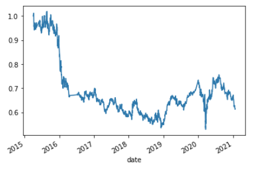
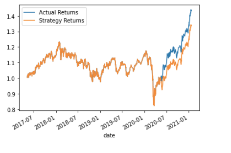

# Algorithmic_Trading

# Overview

This project aims at deploying a trading bot capable of trading based on an algorithm which will execute buy and sell orders in accordance with a trading strategy

I was provided with a dataset of emerging_markets_ohlcv.csv file which was read by python and converted into a dataframe filtered into two columns "Close and Actual Returns" calculated thanks to the pct function and dropna to drop the nan values, after that we generate the trading signals with short and long windows SMA values. Then with the creation of the signals 1, -1 been 1 the buy order and -1 the sell order. We calculate the Strategy Returns by multipliyng the actual returns by the signal values

Then we split the data in training and testing datsets and slicing the time period for the training datasets to 3 months the we used the SVC classifier to fit train and make predictions based on the testing data. after that we review the classification report associated with the SVC model.

# Conclusion 
the performance of the baseline trading algorithm in this 1st fase is giving us a result that the Strategy performs almost the same as the actual returns until the 3Q of 2018. There is when the Strategy start to return better results till now.

# Tune the Baseline Trading Algorithm

---

## Technologies

This setup assumes you already have conda installed.

This project leverages python 3.7 with the following packages:

---

## Results

* Machine Learning Model 1:
  
  * I found that the model 1 wich include the original data is 95% of accuracy
  
  * With a Precision of 100% on the "0" (healthy loans), and 85% on the "1" (risky loans)
  
  * The Recall scores where for "0" 99% and for "1" was of 91%.

* Machine Learning Model 2:
  
  * The Model 2 wich include the resampled data is 99% of accuracy
  
  * With a Precision of 100% on the "0" (healthy loans), and 84% on the "1" (risky loans)
  
  * The Recall scores where for "0" 99% and for "1" was of 99%.
  
---

## Summary

* The model number 2 with the resampled data seems to be the one that performs better due to the diference in accuracy with 99% vs 95% of the model 1., Even when the precision on the model 2 is lower 1% in "1" but in the recall scores the model 2 was better with 8% higher difference against the moldel 1  

* The performance in the problem to solve was better in model 2 since the improvement was more noticeable on the "1" which is the more important factor to predict to be able to detect risky loans 

---
## Contributors

Israel Fernandez

---
